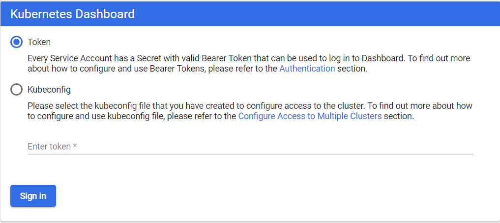
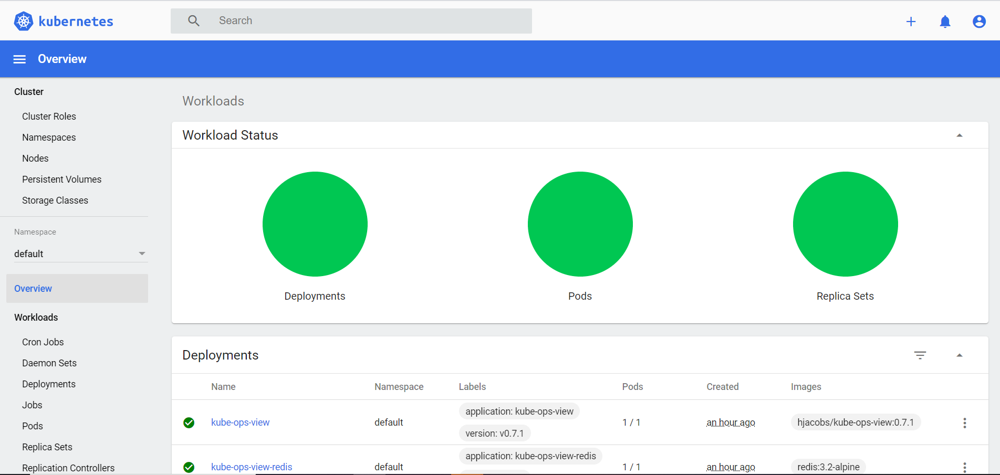
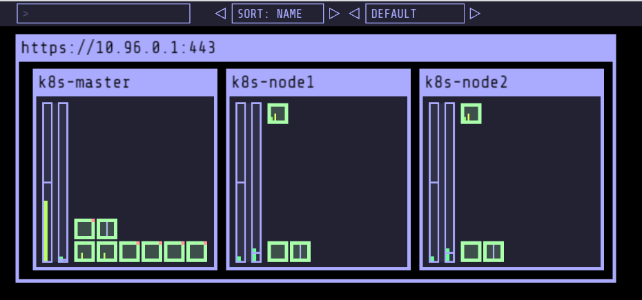

**LAB-01**
=======================================================================================================================================

## Setup Kubernetes Cluster on Centos 9
Prerequisites

- 2048MB RAM + 2 CPU + 20 GB HD (minimum) / node
- Internet access / eth0 interface
- Multiple Linux servers running CentOS 7 (1 Master Node, Multiple Worker Nodes)
- A user account on every system with sudo or root privileges
- The yum package manager, included by default Command-line/terminal window


## Steps for Installing Kubernetes on CentOS 9  [In All Nodes]

To use Kubernetes, you need to install a containerization engine. Currently, the most popular container solution is Docker. 
[Docker needs to be installed on CentOS](https://raw.githubusercontent.com/submah/docker-tutorials/master/docs/install_docker_centos7.md), both on the Master Node and the Worker Nodes.

## Step 1: Install Kernel Headers
First, ensure that you have the appropriate kernel headers installed on your system (on each node). You can install them using the following command:

sudo dnf install kernel-devel-$(uname -r)

## Step 2: Add Kernel Modules
To load the necessary kernel modules required by Kubernetes, you can use the modprobe command followed by the module names (on each node). Here’s how you can do it:

sudo modprobe br_netfilter
sudo modprobe ip_vs
sudo modprobe ip_vs_rr
sudo modprobe ip_vs_wrr
sudo modprobe ip_vs_sh
sudo modprobe overlay

These commands load the required kernel modules (br_netfilter, ip_vs, ip_vs_rr, ip_vs_wrr, ip_vs_sh, overlay) that are essential for Kubernetes to function properly and facilitate communication within the Kubernetes cluster.
By loading these modules, you ensure that your servers are prepared for Kubernetes installation and can effectively manage networking and load balancing tasks within the cluster.
Next, create a configuration file (as the root user on each node) to ensure these modules load at system boot:

cat > /etc/modules-load.d/kubernetes.conf << EOF
br_netfilter
ip_vs
ip_vs_rr
ip_vs_wrr
ip_vs_sh
overlay
EOF

## Step 3: Configure Sysctl

To set specific sysctl settings (on each node) that Kubernetes relies on, you can update the system’s kernel parameters. These settings ensure optimal performance and compatibility for Kubernetes. Here’s how you can configure the necessary sysctl settings:

cat > /etc/sysctl.d/kubernetes.conf << EOF
net.ipv4.ip_forward = 1
net.bridge.bridge-nf-call-ip6tables = 1
net.bridge.bridge-nf-call-iptables = 1
EOF

These commands adjust the following kernel parameters:

Kernel Parameter        	                Description
net.bridge.bridge-nf-call-iptables	        Enables iptables to process bridged IPv4 traffic.
net.bridge.bridge-nf-call-ip6tables    	    Enables iptables to process bridged IPv6 traffic.
net.ipv4.ip_forward	                        Enables IPv4 packet forwarding.

By setting these sysctl parameters, you ensure that your system is properly configured to support Kubernetes networking requirements and forwarding of network traffic within the cluster. These settings are essential for the smooth operation of Kubernetes networking components. Run the following command to apply the changes:

sysctl --system

Step 4: Disabling Swap
To disable swap on each server in your Kubernetes cluster, you can follow these steps:
sudo swapoff -a

This command turns off all swap devices.
sed -e '/swap/s/^/#/g' -i /etc/fstab

## Step 5: Install Containerd
In this step, we’ll install Containerd on each node. Containerd serves as a crucial container runtime responsible for managing and executing containers, which serve as the fundamental units of Kubernetes applications. Containerd provides the necessary infrastructure for container orchestration, ensuring efficient deployment and management of containerized workloads within the Kubernetes ecosystem.

Add the Docker CE Repository
sudo dnf config-manager --add-repo https://download.docker.com/linux/centos/docker-ce.repo

## Update Package Cache
After adding the repository, it’s essential to update the package cache to ensure the latest package information is available:

Now, install the containerd.io package:
sudo dnf -y install containerd.io

After installing Containerd, the next step is to configure it to ensure optimal performance and compatibility with your environment. The configuration file for Containerd is located at /etc/containerd/config.toml. While the default configuration provides a solid starting point for most environments, we’ll make a small adjustment to enable Systemd Cgroup support, which is essential for proper container management. Let’s proceed with configuring Containerd:

cat /etc/containerd/config.toml

...omitted parts of the output for brevity...
          [plugins."io.containerd.grpc.v1.cri".containerd.runtimes.runc.options]
            BinaryName = ""
            CriuImagePath = ""
            CriuPath = ""
            CriuWorkPath = ""
            IoGid = 0
            IoUid = 0
            NoNewKeyring = false
            NoPivotRoot = false
            Root = ""
            ShimCgroup = ""
            SystemdCgroup = false

Run the following command to build out the containerd configuration file:
sudo sh -c "containerd config default > /etc/containerd/config.toml" ; cat /etc/containerd/config.toml

sudo vim /etc/containerd/config.toml
SystemdCgroup = true

This configuration change enables SystemdCgroup support in Containerd, ensuring compatibility with Systemd-managed containers. Once you’ve made these adjustments, Containerd will be configured with SystemdCgroup support, providing enhanced compatibility for managing containers within a Systemd environment.

sudo systemctl enable --now containerd.service
sudo systemctl reboot
Then, run this command to verify the status of the containerd.service. It should be up and running:

sudo systemctl status containerd.service

## Step 6: Set Firewall Rules
To allow specific ports used by Kubernetes components through the firewall, you can execute the following commands (on each node):
sudo firewall-cmd --zone=public --permanent --add-port=6443/tcp
sudo firewall-cmd --zone=public --permanent --add-port=2379-2380/tcp
sudo firewall-cmd --zone=public --permanent --add-port=10250/tcp
sudo firewall-cmd --zone=public --permanent --add-port=10251/tcp
sudo firewall-cmd --zone=public --permanent --add-port=10252/tcp
sudo firewall-cmd --zone=public --permanent --add-port=10255/tcp
sudo firewall-cmd --zone=public --permanent --add-port=5473/tcp

These commands add firewall rules to allow traffic on the specific ports required by Kubernetes components:

Port(s)	        Description
6443	        Kubernetes API server
2379-2380	    etcd server client API
10250	        Kubelet API
10251	        kube-scheduler
10252	        kube-controller-manager
10255	        Read-only Kubelet API
5473	        ClusterControlPlaneConfig API

After executing these commands, the firewall will permit traffic on the specified ports, ensuring proper communication between Kubernetes components. Remember to reload the firewall to apply the changes:
sudo firewall-cmd --reload

## Step 7: Install Kubernetes Components
To install Kubernetes components (kubelet, kubeadm, and kubectl) and add the Kubernetes repository to your package manager, you can follow these steps:

```
cat <<EOF | sudo tee /etc/yum.repos.d/kubernetes.repo
[kubernetes]
name=Kubernetes
baseurl=https://pkgs.k8s.io/core:/stable:/v1.29/rpm/
enabled=1
gpgcheck=1
gpgkey=https://pkgs.k8s.io/core:/stable:/v1.29/rpm/repodata/repomd.xml.key
exclude=kubelet kubeadm kubectl cri-tools kubernetes-cni
EOF
```
Install Kubernetes Packages

Once the repository is added, you can proceed to install the Kubernetes components (kubelet, kubeadm, and kubectl) using the package manager. Run the following command:

dnf makecache; dnf install -y kubelet kubeadm kubectl --disableexcludes=kubernetes

The --disableexcludes=kubernetes flag ensures that packages from the Kubernetes repository are not excluded during installation.

Start and Enable kubelet Service
After installing kubelet, start and enable the kubelet service to ensure it starts automatically upon system boot:

systemctl enable --now kubelet.service

💡Don’t worry about any kubelet errors at this point. Once the worker nodes are successfully joined to the Kubernetes cluster using the provided join command, the kubelet.service on each worker node will automatically activate and start communicating with the control plane. The kubelet is responsible for managing the containers on the node and ensuring that they run according to the specifications provided by the Kubernetes control plane.

Install a Kubernetes Cluster on RHEL 9 | CentOS 9: Master Node Configuration

👀NOTE: Up until this point of the installation process, we’ve installed and configured Kubernetes components on all nodes. From this point onward, we will focus on the master node.

Step 8: Initializing Kubernetes Control Plane
Great! Let’s proceed with initializing the Kubernetes control plane on the master node. Here’s how we can do it:

sudo kubeadm config images pull
After executing this command, Kubernetes will pull the necessary container images from the default container registry (usually Docker Hub) and store them locally on the machine. This step is typically performed before initializing the Kubernetes cluster to ensure that all required images are available locally and can be used without relying on an external registry during cluster setup.

sudo kubeadm init --pod-network-cidr=10.244.0.0/16

Your Kubernetes control-plane has initialized successfully!

To start using your cluster, you need to run the following as a regular user:

  mkdir -p $HOME/.kube
  sudo cp -i /etc/kubernetes/admin.conf $HOME/.kube/config
  sudo chown $(id -u):$(id -g) $HOME/.kube/config

Alternatively, if you are the root user, you can run:

  export KUBECONFIG=/etc/kubernetes/admin.conf

You should now deploy a pod network to the cluster.
Run "kubectl apply -f [podnetwork].yaml" with one of the options listed at:
  https://kubernetes.io/docs/concepts/cluster-administration/addons/

Then you can join any number of worker nodes by running the following on each as root:

kubeadm join 192.168.1.26:6443 --token y8cow4.jib2syhyrb0bh1dt \
	--discovery-token-ca-cert-hash sha256:cb67fddec41469cf1f495db34008ae1a41d3f24ce418b46d5aefb262a1721f43

 This command initializes the Kubernetes control plane on the master node. The --pod-network-cidr flag specifies the range of IP addresses for the pod network. Adjust the CIDR according to your network configuration if needed.

Set Up kubeconfig File

Set up the kubeconfig file to enable communication with the Kubernetes cluster. Run the following commands:

mkdir -p $HOME/.kube
sudo cp -i /etc/kubernetes/admin.conf $HOME/.kube/config
sudo chown $(id -u):$(id -g) $HOME/.kube/config

Deploy Pod Network
To enable networking between pods across the cluster, deploy a pod network. For example, deploy the Tigera Operator for Calico:

kubectl create -f https://raw.githubusercontent.com/projectcalico/calico/v3.26.1/manifests/tigera-operator.yaml

To download the custom Calico resources manifest, you can use the curl or wget command to fetch the YAML file from the Calico project’s GitHub repository. Here’s how you can do it using curl:

curl -O https://raw.githubusercontent.com/projectcalico/calico/v3.26.1/manifests/custom-resources.yaml
wget https://raw.githubusercontent.com/projectcalico/calico/v3.26.1/manifests/custom-resources.yaml

Adjust the CIDR setting in the custom resources file:
sed -i 's/cidr: 192\.168\.0\.0\/16/cidr: 10.244.0.0\/16/g' custom-resources.yaml

Finally, create the Calico custom resources:
kubectl create -f custom-resources.yaml

Step 9: Join Worker Nodes
After successfully initializing the Kubernetes control plane on the master node, you’ll need to join the worker nodes to the cluster. Kubernetes provides a join command that includes a token and the master node’s IP address to allow worker nodes to connect to the cluster. Here’s how you can do it:

Get Join Command on Master Node

On the master node, run the following command to generate the join command along with a token:

kubeadm join 192.168.1.26:6443 --token kyy7v6.h26obyvthe08ohsn --discovery-token-ca-cert-hash sha256:cb67fddec41469cf1f495db34008ae1a41d3f24ce418b46d5aefb262a1721f43

This command generates a join command with a token that allows worker nodes to join the cluster. It also includes the master node’s IP address.

Run Join Command on Worker Nodes
Copy the join command generated in the previous step and run it on each worker node. The join command typically looks like this:

sudo kubeadm join <MASTER_IP>:<MASTER_PORT> --token <TOKEN> --discovery-token-ca-cert-hash <DISCOVERY_TOKEN_CA_CERT_HASH>

Replace <MASTER_IP>, <MASTER_PORT>, <TOKEN>, and <DISCOVERY_TOKEN_CA_CERT_HASH> with the appropriate values from the join command generated on the master node.

Verify Worker Node Join
After running the join command on each worker node, switch back to the master node and run the following command to verify that the worker nodes have successfully joined the cluster:

kubectl get nodes

This command should list all the nodes in the cluster, including the master node and the newly joined worker nodes. The status of the worker nodes should be “Ready,” indicating that they have successfully joined the cluster and are ready to accept workloads.

NAME                    STATUS   ROLES           AGE     VERSION
master.naijalabs.net    Ready    control-plane   60m     v1.29.3
worker1.naijalabs.net   Ready    <none>          5m16s   v1.29.3
worker2.naijalabs.net   Ready    <none>          2m40s   v1.29.3

### Launching Kubernetes Dashboard
```yml
wget https://raw.githubusercontent.com/kubernetes/dashboard/v2.0.0/aio/deploy/recommended.yaml

#Open the file and update the service to
ports:
  - nodePort: 32414
    port: 443
    targetPort: 8443
type: NodePort

#To apply 
kubectl apply -f recommended.yaml
```

### Creating a Service Account If you are using cloud account
We are creating Service Account with name admin-user in namespace kubernetes-dashboard first.
```
cat <<EOF | kubectl apply -f -
apiVersion: v1
kind: ServiceAccount
metadata:
  name: admin-user
  namespace: kubernetes-dashboard
EOF
```

### Creating a ClusterRoleBinding
the ClusterRole cluster-admin already exists in the cluster. We can use it and create only ClusterRoleBinding for our ServiceAccount. If it does not exist then you need to create this role first and grant required privileges manually.
```
cat <<EOF | kubectl apply -f -
apiVersion: rbac.authorization.k8s.io/v1
kind: ClusterRoleBinding
metadata:
  name: admin-user
roleRef:
  apiGroup: rbac.authorization.k8s.io
  kind: ClusterRole
  name: cluster-admin
subjects:
- kind: ServiceAccount
  name: admin-user
  namespace: kubernetes-dashboard
EOF
```

In order to access the Kubernetes dashboard https://Node-IP-Address:32414 

[output]



__Getting a Bearer Token__
```yml
kubectl -n kubernetes-dashboard describe secret $(kubectl -n kubernetes-dashboard get secret | grep admin-user | awk '{print $1}')
#Copy and paste the token on the dashboard browser window
```
```
kubectl -n kubernetes-dashboard create token admin-user
```



### Set up Visualiser
```
git clone https://github.com/submah/kubernetes.git
kubectl apply -f kubernetes/kubernetes-ops-view/deploy
```
[Output]
```
serviceaccount/kube-ops-view created
clusterrole.rbac.authorization.k8s.io/kube-ops-view created
clusterrolebinding.rbac.authorization.k8s.io/kube-ops-view created
deployment.apps/kube-ops-view created
ingress.extensions/kube-ops-view created
deployment.apps/kube-ops-view-redis created
service/kube-ops-view-redis created
service/kube-ops-view created
```

Visualiser is accessable over a service port whic we can get it for below command

```
kubectl get svc | grep -i kube-ops-view
```


```
http://<NODE_IP>:servie-port/#scale=2.0
```




